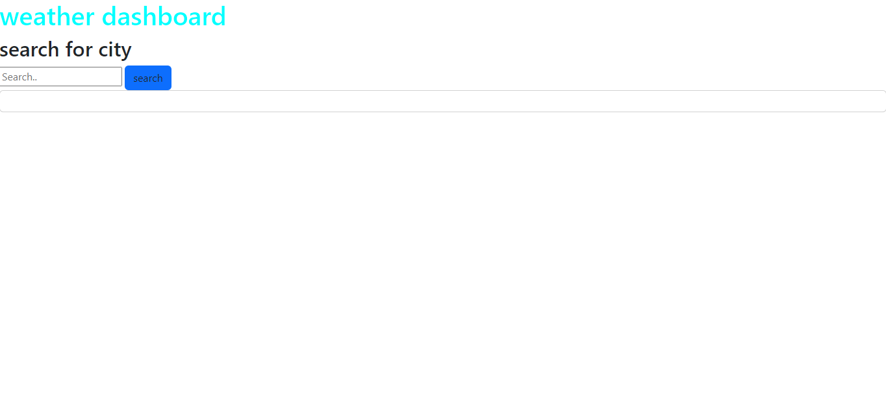

# weather-dashboard

I used the index.html to make a simple frame for the website and link all of my required sites.

i used java script to get the information needed for the website from the api's and to append the information to the page.

deployed link:
github link:

